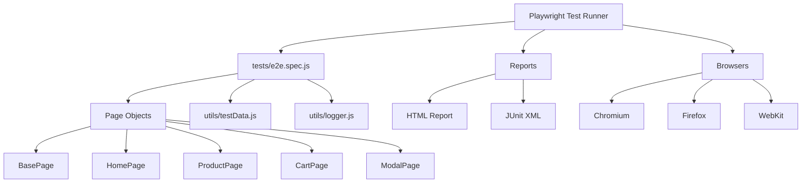
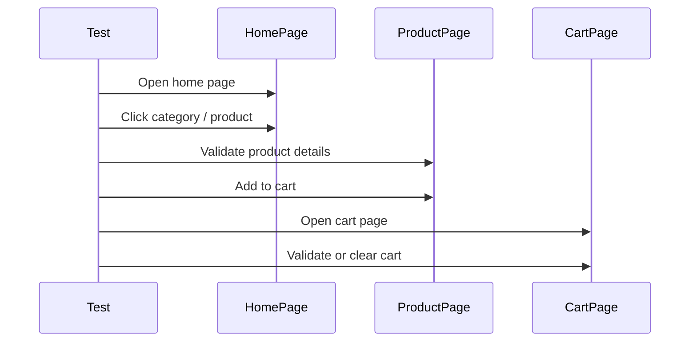

# 🛒 Demoblaze Playwright Automation Suite


A stable, portfolio-ready **Playwright automation framework** built for the public DemoBlaze demo store.

It includes:

* a clean **Page Object Model**
* **12 end-to-end tests**
* **soft assertions** where useful
* **step logging** for clearer execution
* **element highlighting** for live runs
* **tag filtering** for smoke/cart runs
* **multi-browser support**
* **HTML + JUnit reporting**
* a **GitHub Actions CI pipeline**

---

## ✨ What this project covers

This suite validates the most important user flows on DemoBlaze:

* Home page and category navigation
* Product detail page validation
* Add to cart and remove from cart
* Contact modal
* Sign up modal
* Login modal
* About modal
* Cart page
* Place order modal

---

## 🧠 Why this framework is useful

This project is designed to look and feel like a real QA automation framework, not just a demo script collection.

It shows:

* how to structure reusable page objects
* how to keep locators stable
* how to reduce flakiness with better waits
* how to run the same suite across browsers
* how to use tags for targeted execution
* how to make test runs readable in reports and trace viewer

---

## 🏗️ Architecture at a glance



---

## 🔁 Test flow



---

## 📁 Project structure

```text
Playwright-automation-suite/
├── pages/
│   ├── BasePage.js
│   ├── HomePage.js
│   ├── ProductPage.js
│   ├── CartPage.js
│   └── ModalPage.js
├── tests/
│   └── e2e.spec.js
├── utils/
│   ├── logger.js
│   └── testData.js
├── reports/
├── test-results/
├── .github/
│   └── workflows/
│       └── playwright.yml
├── playwright.config.js
├── package.json
└── README.md
```

---

## 🧪 What the 12 tests cover

| #  | Scenario                  | Tag      |
| -- | ------------------------- | -------- |
| 1  | Home page loads           | `@smoke` |
| 2  | Category filtering        | `@smoke` |
| 3  | Product page details      | -        |
| 4  | Add product to cart       | `@cart`  |
| 5  | Remove product from cart  | `@cart`  |
| 6  | Contact modal             | -        |
| 7  | Sign up modal             | -        |
| 8  | Login modal               | -        |
| 9  | About modal               | -        |
| 10 | Cart page loads           | -        |
| 11 | Place order modal         | -        |
| 12 | Multi-category navigation | -        |

---

## 🚀 Getting started

### 1) Install dependencies

```bash
npm install
```

### 2) Install Playwright browsers

```bash
npx playwright install
```

### 3) Run the full suite

```bash
npx playwright test
```

### 4) Run in headed mode

```bash
npx playwright test --headed
```

### 5) Run only one browser

```bash
npx playwright test --project=chromium
```

---

## 🎯 Useful commands

Run smoke tests only:

```bash
npx playwright test --grep "@smoke"
```

Run cart tests only:

```bash
npx playwright test --grep "@cart"
```

Open the HTML report:

```bash
npx playwright show-report reports/html
```

---

## 🧩 Base URL

The suite uses DemoBlaze by default:

```js
https://www.demoblaze.com
```

You can override it with an environment variable:

```bash
BASE_URL=https://www.demoblaze.com npx playwright test
```

---

## 🧱 Page Object Model design

Each page object keeps the site interactions in one place:

* **BasePage** → shared helpers like open, click, fill, and highlight
* **HomePage** → navigation, categories, modals
* **ProductPage** → product detail and add-to-cart flow
* **CartPage** → cart rows, delete, place order
* **ModalPage** → modal title locators

This keeps the tests short, readable, and easier to maintain.

---

## 🎨 Visual highlighting

Clickable and fillable elements are highlighted during execution so you can see what the test is interacting with.

This helps during:

* headed local runs
* demo sessions
* debugging flaky locators

---

## 🧷 Stability notes

This framework was tuned for stability on a live demo site:

* avoids brittle selectors where possible
* uses unique locators for modal titles
* clears cart state when needed
* avoids waiting for `networkidle` on a site that keeps background activity alive
* uses browser-safe assertions and waits

---

## 🛠 Reporting and artifacts

After a run, you get:

* HTML report in `reports/html`
* JUnit output for CI
* screenshots on failure
* videos on failure
* trace files for retries/failures

These are useful for debugging and for sharing results with a team.

---

## 🤖 CI pipeline

The repository includes GitHub Actions so tests run automatically on:

* push
* pull request

The workflow installs dependencies, installs browsers, runs the suite, and uploads the HTML report.

---

## 📦 Tech stack

* **Playwright Test**
* **JavaScript**
* **Node.js**
* **GitHub Actions**
* **HTML/JUnit reporting**

---

## 🙌 Built with AI assistance

This framework was assembled quickly from the requirements using AI assistance, including **Claude AI**, to help shape the structure, refine the test design, and turn the idea into a working automation suite.

That said, the important part is not the tool used to scaffold it. The important part is that the result is a real, runnable framework with reusable page objects, stable tests, and CI-ready structure.

---

## 📌 Portfolio highlights

This repository is good to show in a resume or GitHub profile because it demonstrates:

* test design thinking
* real browser automation
* maintainable architecture
* cross-browser coverage
* CI familiarity
* practical debugging and flake reduction

---

## 🧰 Troubleshooting

If tests fail in a local environment, check:

* browser installation with `npx playwright install`
* headless mode in Linux/Codespaces
* stale cart state in the browser
* correct `BASE_URL`
* whether the site is reachable in your network

---

## 📷 Suggested project visuals

You can add these to the README later:

* a screenshot of the HTML report
* a screenshot of the trace viewer
* a screenshot of a successful test run
* a badge for the GitHub Actions workflow

---

## ✅ Final note

This project is intentionally small enough to understand quickly, but complete enough to show real QA automation skills.

It is a good balance of:

* simplicity
* stability
* readability
* interview value

---

Made with 💚 for QA automation practice and portfolio building.
